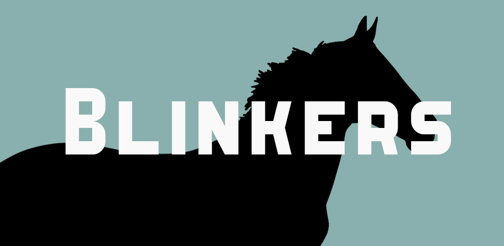

<p align="center">
    
  </a>
</p>
<p align="center"> 📚 A text editor for extreamism researcher, allowing to filter violent and sensative text 💻</p>

<br>

Blinkers is a simple UI based text editor that allows for filtering sensative, violent, and radical content limiting the exposure to researchers.

Blinkers currently supports the following features:
- Open, Save, and Modify text files just as you'd expect from any text editor 📝
- Highlighting words in a file using ```Ctrl+P``` or bt supplying a newline seperated file. 🎨
- Change the saturation of non-highlighted text, limiting exposure 🖌️


<p align="center"></p>


## Instalation and Running 
Currently Blinkers requires Python to run, however, in the future will be bundled into an executable/ binary for Windows and Debian. 

```bash
python3 blinkers.py
```

## Usage

-  **Load a file** - Opening a file can be done with ```Ctrl+O``` or by using the ```File``` menu. A new file can be created with ```Ctrl+N```.
-  **Save a file** - To save a file use ```Ctrl+S``` or use the ```File``` menu.
-  **Exit** - To exit the application use the ```Ctrl+E``` or the ```File``` menu.
-  **Cut** - To cut text in the application use the ```Ctrl+X``` or the ```Edit``` menu.
-  **Copy** - To copy text in the application use the ```Ctrl+C``` or the ```Edit``` menu.
-  **Paste** - To paste text in the application use the ```Ctrl+V``` or the ```Edit``` menu.
-  **Undo** - To undo modifications in the application use the ```Ctrl+U``` or the ```Edit``` menu.
-  **Add filter file** - A filter file is a new line seperated text file where each line contains a word that should be highlighted in the text editor. To do this use ```Ctrl+F``` or the ```Edit``` menu.
-  **Remove filters **- To remove all current filters/ highlights use ```Ctrl+R``` or the ```Edit``` menu.
-  **Add a string to the filter **- To add a string to highligh use ```Ctrl+P``` or the ```Edit``` menu. if a filter file is open the new string will be appended to the bottom of the file.
-  **Remove string from the filter** - To remove a string from highlighting text use ```Ctrl+B``` or the ```Edit``` menu. If a filter file is being used it will remove it from the file.
-  **Increase and Decrease color saturation** - The color of non highlighted text can be modified with ```Alt+U``` and ```Alt+D``` or the ```Edit``` menu.
